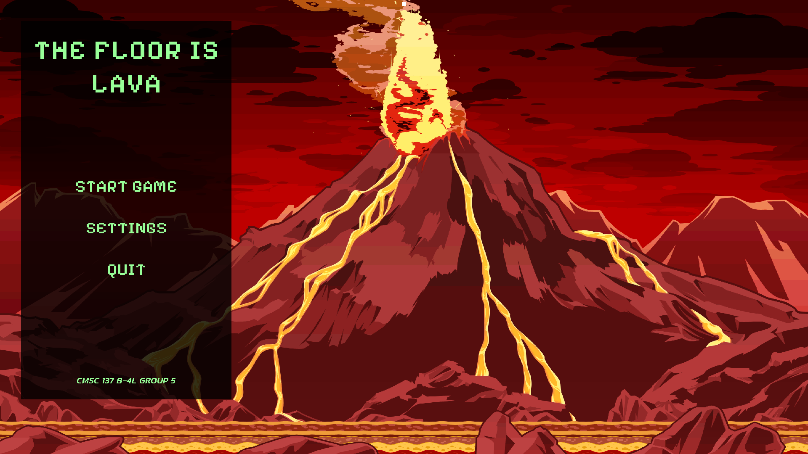

# The Floor is Lava
This is a 2D Java Game that allows multiplayer mode. The game revolves around the concept of “The Floor is Lava”. There is a platform consisting of normal tiles and lava tiles/pits. This platform may also shrink by generating lava pits at the edges/boundaries of the platform itself. Upon playing the game, 4 players are spawned on the platform. The players can push another player into a lava pit, making the other player take damage and lose a life. These players have 3 lives. They will continue to respawn at set intervals if they still have lives. However, upon depleting your health pool, you are considered out and done for the game.

## How to Run
- Install the necessary requirements
    - Latest Java Build
        - For Windows:  https://www.java.com/download/ie_manual.jsp
        - For Linux: ```sudo apt install default-jdk```
    - Visual Studio Code (For Developers)

## Game Sample
### Title Screen
<!-- insert image here from assets/images/ -->


### Gameplay

## Credits
- How to Make a 2D Game in Java by RyiSnow
    - https://www.youtube.com/playlist?list=PL_QPQmz5C6WUF-pOQDsbsKbaBZqXj4qSq